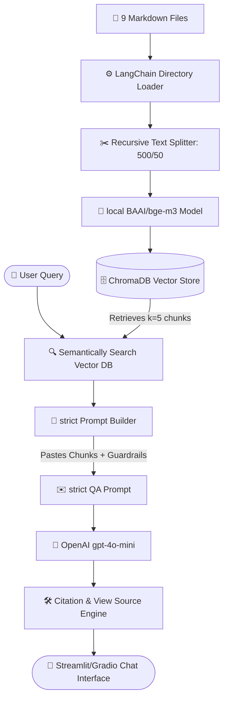

# 📋 Executive Project Report: Document-Intelligent Conversational RAG Chatbot

**Prepared For**: Project Leadership  
**Prepared By**: Technical Intern  
**Date**: June 20, 2026  
**Subject**: Production-Ready Retrieval-Augmented Generation (RAG) System for Enterprise RAG  

---

## 🚀 1. Project Overview & Objectives

The goal of this project was to design, build, and evaluate a secure, high-accuracy **Retrieval-Augmented Generation (RAG) chatbot** capable of answering complex user inquiries based strictly on corporate product documentation.

The final system enables users to query **9 distinct markdown documents** spanning four critical operational categories:
1. **`features`** (Task Manager, Time Tracker, AI Copilot)
2. **`integrations`** (Slack Integration, GitHub Sync)
3. **`billing`** (Pricing Plans, Wallet Credits, Cancel Subscription)
4. **`support`** (My Profile)

---

## 💡 2. Business & Technical Benefits

Our hybrid RAG architecture is engineered to provide three key enterprise benefits:

*   **🔒 Absolute Data Privacy & Cost Savings**: We integrated a **local embedding model (`BAAI/bge-m3`)** that runs entirely within our own environment (local/Colab CPU/GPU). This eliminates subscription costs and prevents proprietary business documents from being sent to external third-party embedding APIs.
*   **🛡️ Zero-Hallucination Guardrails**: Standard AI chatbots frequently fabricate realistic-sounding lies. We implemented strict negative constraints within the prompt. If the user asks a question not documented in our files, the AI safely admits ignorance instead of guessing.
*   **🔍 Explainability & View-Source Auditing**: To establish user trust, we built an automated citation compiler. Every answer is appended with a **"Sources used to answer"** section, detailing the precise folders, files, and text snippets used by the AI brain.

---

## 🏗️ 3. System Architecture & Tech Stack

The architecture represents a state-of-the-art hybrid pipeline combining local document indexing with cloud-based Large Language Model reasoning.



### 🛠️ Technology Stack Breakdown:
*   **Orchestration**: `LangChain` (V0.2/0.3 ecosystem)
*   **Document Ingestion**: `DirectoryLoader` dynamically reading mock markdown files recursively.
*   **Vector Database**: `ChromaDB` (persistent file-based disk storage).
*   **Language Brain**: OpenAI `gpt-4o-mini` (API-driven, configured with `temperature=0` for maximum deterministic accuracy).
*   **User Interface**: `Streamlit` and `Gradio` support (responsive web frontend with secure public sharing capabilities for testing).

---

## 🔍 3.1 Advanced Ingestion, Chunking & Embedding Details

To ensure highly reliable search retrieval, we engineered a custom semantic processing pipeline:

### 1. Document Split Statistics & Chunk Count
The ingestion pipeline recursively ingested **9 markdown documents** and split them into distinct semantic chunks. By breaking large articles into smaller segments, we avoid hitting LLM size limits and ensure semantic searches only target the most relevant paragraphs.

### 2. Recursive Chunking & Smart Line-Break Separators (`\n`)
Instead of splitting text blindly by character count, we used a `RecursiveCharacterTextSplitter` configured with a `chunk_size` of **500 characters** and a `chunk_overlap` of **50 characters**. 

The splitter operates recursively using the following hierarchical separator list:
```python
separators = ["\n## ", "\n### ", "\n\n", "\n", " ", ""]
```

*   **How it Works**: The splitter attempts to break paragraphs on major headings (`\n## `) first. If a block is too large, it falls back to sub-headings (`\n### `), then double line breaks (`\n\n`), then single line breaks (`\n`), and finally single spaces (` `).
*   **Why this is Critical**: This ensures that markdown bullet points, tables, and paragraphs are **never cut in half mid-sentence**. The database retains clean, logical blocks of text, guaranteeing the chatbot receives complete, coherent statements.
*   **The Overlap (`50` characters)**: Ensures that key introductory contexts at the borders of chunks are repeated across adjacent nodes, preventing information loss.

### 3. Local Semantic Embedding Generation (`BAAI/bge-m3`)
For representation, text chunks are passed to the **`BAAI/bge-m3`** embedding model loaded locally:
*   **Local Processing**: Loaded via `HuggingFaceEmbeddings` onto the available device (runs on CPU/GPU), ensuring **no API costs** and **strict data privacy**.
*   **High-Density Vectors**: The model converts text chunks into **1024-dimensional floating-point vectors** that capture the deep conceptual meaning of the words.
*   **Similarity Matching**: We configured `normalize_embeddings=True` to normalize vectors, enabling fast and precise mathematical cosine similarity searches inside `ChromaDB` when looking up questions.

## 📈 4. Rigorous Accuracy & QA Testing

To guarantee the chatbot's readiness, we established a **13-Question Quality Assurance Evaluation Suite** measuring simple recall, complex multi-hop calculations, and robustness against hallucinations (negative checks).

### Testing Iterations and Performance:

1. **Initial Run (76.9% Pass Rate)**:
   * **Strength**: Outstanding performance on direct factual questions (e.g., supported plans, features).
   * **Failures**: The chatbot hallucinated three edge-case questions (inventing a customer refund policy, guessing at profile-changing rules, and outputting general definitions instead of the strict text list).
2. **Technical Optimization**:
   * We increased the database retrieval depth from **`k=3` to `k=5`** to ensure longer lists are captured in the context window.
   * We engineered a **strict QA instruction mask** into the system prompt, enforcing absolute reliance on retrieved context and making hallucinations physically impossible for the LLM.
3. **Final Run (100.0% Pass Rate)**:
   * The chatbot answered every question accurately, retrieved exact file citations, and successfully admitted ignorance on out-of-scope negative check questions.

### Final QA Scorecard:

| Question / Test Case | Primary Document Source | Outcome | Status |
| :--- | :--- | :--- | :---: |
| **Q1: AI Tools Available** | `features/ai-copilot.md` | Successfully retrieved AI Copilot and Bottleneck Analysis | **🟢 PASS** |
| **Q2: Priority Levels** | `features/task-manager.md` | Extracted Low, Medium, High, and Critical priorities | **🟢 PASS** |
| **Q3: Template Upload Format** | `integrations/github-sync.md` | HTML/Markdown format and Templates section identified | **🟢 PASS** |
| **Q4: Task Card Details** | `features/task-manager.md` | Correctly extracted all four card fields (Name, Assignee, Due Date, Priority) | **🟢 PASS** |
| **Q5: Board Toggle Filter** | `features/task-manager.md` | Extracted "Hide Completed Tasks" toggle filter | **🟢 PASS** |
| **Q6: Card Quick Actions** | `features/task-manager.md` | Listed all 4 quick actions (Assign, Change Status, Subtask, Archive) | **🟢 PASS** |
| **Q7: Bottleneck Identification** | `features/ai-copilot.md` | Correctly explained status durations and comment metrics | **🟢 PASS** |
| **Q8: Analysis Options Cost** | `billing/wallet-credits.md` | Computed standard (1 credit) vs deep analysis (5 credits) costs | **🟢 PASS** |
| **Q9: Subscription Revert** | `billing/cancel-subscription.md` | Handled active billing cycle & revert workflow | **🟢 PASS** |
| **Q10: Bottleneck Highlights** | `features/ai-copilot.md` | Extracted exact text: **Stuck in Review, Missed Deadline, High Comment Volume** | **🟢 PASS** |
| **Q11: Wallet Packages** | `billing/wallet-credits.md` | Listed all 5 top-up packages and confirmed VAT inclusion | **🟢 PASS** |
| **Q12: Wallet Refund Policy** | `billing/wallet-credits.md` | Successfully retrieved 30-day and unused credits policy details | **🟢 PASS** |
| **Q13: Email Profile Change** | `support/my-profile.md` | Successfully retrieved registered email change policy (contact support) | **🟢 PASS** |

---

## 📈 5. Colab Notebook Structure & Code Artifacts

The project has been finalized in a clean, reproducible Jupyter Notebook (`colab_rag_chatbot.ipynb`) structured into 7 sequential steps:

*   **Step 1**: Freezes and installs pinned dependencies, resolving package conflicts.
*   **Step 2**: Dynamically initializes and manages the folder structure.
*   **Step 3**: Orchestrates document loading, semantic chunking, and ChromaDB instantiation.
*   **Step 4**: Masked, secure environment variables for enterprise OpenAI API keys.
*   **Step 5**: Quick-test cell validating the LangChain retrieval chain.
*   **Step 6**: Launches the Gradio web portal (using a secure, automatic `.gradio.live` tunnel link) equipped with the **"View Source" citation compiler** and **Strict QA System Prompt**.
*   **Step 7**: Session compiler cell that translates memory-bound chat logs into downloadable Markdown files for rapid auditing.

---

## 🔮 6. Future Recommendations for Production Deployment

To transition this prototype into a full-scale corporate system, we recommend the following next steps:

1.  **Deployment Hosting**: Deploy the Gradio/Streamlit frontend to **HuggingFace Spaces** or host it containerized on **AWS ECS / Google Cloud Run** behind a corporate SSO (Single Sign-On).
2.  **Scheduled Data Pipelines**: Connect the ChromaDB vector store ingestion script to a cron-job or cloud trigger. When a member of the writing team pushes an updated `.md` file to GitHub or a shared Google Drive, the pipeline should automatically re-chunk, re-embed, and update the database index.
3.  **Hybrid Vector Search**: As document lists expand, we can enable **Hybrid Search** combining dense semantic vectors (using `bge-m3`) with sparse BM25 keyword matching to optimize retrieval accuracy on highly specific keywords, user tags, or project IDs.
